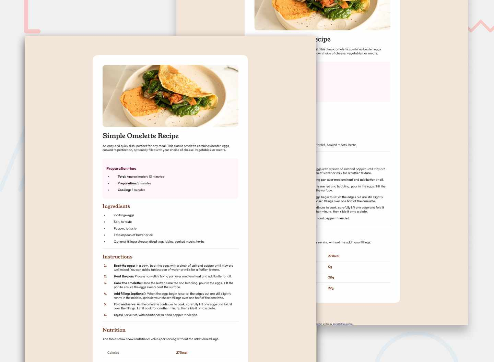

# Frontend Mentor - Recipe Page Solution

This is my solution to the **Recipe Page** challenge on Frontend Mentor. The objective of this project is to recreate a responsive recipe page while practicing semantic HTML, responsive CSS layouts, typography hierarchy, and structured content presentation.

## Preview



## Links

- **Live Site:** https://shrigel.github.io/recipe-page/
- **Frontend Mentor Challenge:** https://www.frontendmentor.io/challenges/recipe-page-KiTsR8QQKm

## Built With

- Semantic HTML5
- CSS3
- Flexbox
- CSS Custom Properties
- Responsive Design
- Google Fonts (Young Serif & Outfit)
- Media Queries

## Layout

The original design was created for the following viewport widths:

- **Mobile:** 375px
- **Desktop:** 1440px

The recipe page adapts across different screen sizes, including a dedicated mobile layout that adjusts spacing, border radius, and image presentation while preserving readability.

## Style Guide

### Colors

| Color | HSL |
|--------|-----|
| White | `hsl(0, 0%, 100%)` |
| Stone 100 | `hsl(30, 54%, 90%)` |
| Stone 150 | `hsl(30, 18%, 87%)` |
| Stone 600 | `hsl(30, 10%, 34%)` |
| Stone 900 | `hsl(24, 5%, 18%)` |
| Brown 800 | `hsl(14, 45%, 36%)` |
| Rose 800 | `hsl(332, 51%, 32%)` |
| Rose 50 | `hsl(330, 100%, 98%)` |

### Typography

**Body Copy**

- Paragraph font size: **16px**

**Fonts**

**Young Serif**

- Family: [Young Serif](https://fonts.google.com/specimen/Young+Serif)
- Weight: **400**

**Outfit**

- Family: [Outfit](https://fonts.google.com/specimen/Outfit)
- Weights: **400, 600, 700**

## Project Structure

```text
├── images
│   ├── favicon-32x32.png
│   ├── image-omelette.jpeg
│   └── preview.jpg
├── index-styles.css
├── index.html
└── README.md
```

## What I Practiced

Through this project, I practiced:

- Structuring long-form content with semantic HTML elements.
- Creating a responsive card layout using Flexbox and media queries.
- Building a consistent design system with CSS Custom Properties.
- Styling lists, tables, and separators to match a design specification.
- Combining multiple Google Fonts to create a clear visual hierarchy.
- Adapting desktop layouts into a polished mobile experience.

## Author

- GitHub - [@shrigel](https://github.com/shrigel)
- Frontend Mentor - [@shrigel](https://www.frontendmentor.io/profile/shrigel)
